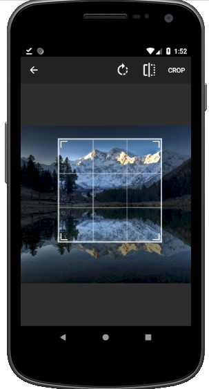

# PhotoBlog App
This is a Blog app. It makes images easy to share and Upload.
# Capabilities
* Sign in / Sign up 
* Account Setup
* Upload Images

# External Libraries Used
* Firebase Auth
* Cloud Firestore
* Firebase Storage
* Glide
* ImageCropper
 # Screenshots
 

 
  
  
   
 

